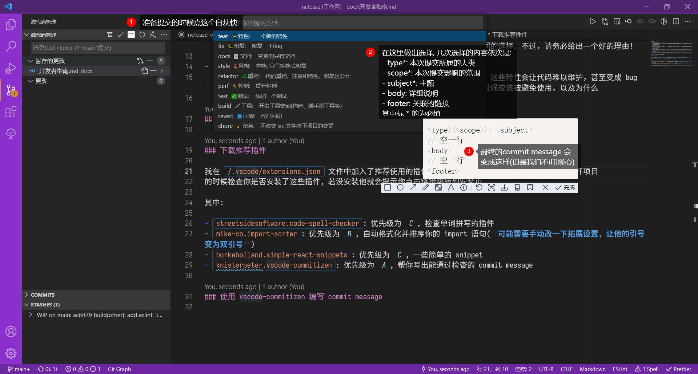

# 开发者指南

以下内容中:

- **优先级 A：必要的**  
  这些规则会帮你规避错误，所以请务必学习并遵守它们。可能存在例外的情况，但应该非常少，而且需要同时精通 JavaScript 和 React 的人来决定。

- **优先级 B：强烈推荐**  
  这些规则能够在绝大多数工程中改善可读性和开发体验。即使你违反了它们，代码还是能照常运行。但此类例外应该尽可能地少，且有充分的理由。

- **优先级 C：推荐**  
  当存在有多个同样好的选项时，可以选择其中任意一项以确保一致性。在这些规则里，我描述每个可取的选项，并建议使用一个默认的。也就是说，只要保持一致且理由充分，你可以自由地在代码库中做出不同的选择。不过，请务必给出一个好的理由！

- **优先级 D：谨慎使用**  
  某些特性的存在是为了照顾极端情况，或帮助老代码平稳迁移。当被过度使用时，这些特性会让代码难以维护，甚至变成 bug 的来源。这些规则的存在是为了给有潜在风险的特性敲响警钟，说明它们在哪些时候应该被避免使用，以及为什么

## 优先级 A 的规范: 必要的 (规避错误)

### 下载推荐插件

我在 `/.vscode/extensions.json` 文件中加入了推荐使用的插件, 如果不出意外的话 vscode 会在你每次打开项目
的时候检查你是否安装了这些插件, 若没安装他就会提示你点击链接跳转到安装页

其中:

- `streetsidesoftware.code-spell-checker`: 优先级为 _C_, 检查单词拼写的插件
- `mike-co.import-sorter`: 优先级为 _B_, 自动格式化并排序你的 import 语句. 可能需要手动改一下拓展设置:
  - 他默认引用的路径是用单引号, 改为双引号
  - 默认好像没有保存时格式化, 需手动打开
- `burkeholland.simple-react-snippets`: 优先级为 _C_, 一些简单的 snippet
- `knisterpeter.vscode-commitizen`: 优先级为 _A_, 帮你写出能通过检查的 commit message
- `dbaeumer.vscode-eslint`: 优先级为 _S_, 实时显示 eslint 检测出的问题

### 使用 vscode-commitizen 编写 commit message



如不合规范会提交失败

### 代码需经过 eslint 检查无误再提交

此处已经配置好**提交前自动检查**, 可以通过 `yarn lint` 指令手动触发执行

### 使用 yarn 而非 npm

混用两者会导致包的版本出现异常

常用指令:

- `yarn dev/yarn start`: 启动项目 dev 服务
- `yarn add xxx`: 下载包, 如下载**仅在开发时使用的包**(不会被打包到最后的代码中, 如 sass, ts), 在最后加上`-D`参数
- `yarn build`: 打包
- `yarn lint`: 触发 eslint 检查

### 在 dev 分支开发而非 main

现在远端有两个分支: main 和 dev, 其中:

- main: 存放稳定版代码, 是线上正常运行的版本
- dev: 开发时用的版本, 可存在未完成的功能

当在 dev 上开发完一系列功能时, `git switch main && git merge dev` 即可将新功能同步到主分支

常用 git 指令:

```bash
git switch xxx      # 切换到某一分支
git merge xxx       # 将 xxx 分支合并到现在所在的分支
git switch -c xxx   # 创建并切换分支
git branch -d xxx   # 删除某分支(若此分支还没被合并过会报错, 所以不用担心代码没了)
```

除 dev 分支外, 每开发一个新功能都需要在本地新开一个分支(不用推送到远端). 开发完成后合并到 dev 并推送  
无伤大雅的小更改可直接在 dev 上完成  
合并到 dev 后即可删除本地这个分支

如:


此举用意在于: 每个 feat 分支相互独立可并行开发, 若开发中哪里出现问题可以单独回退而不用影响别的 feat 的代码

## 优先级 B 的规则：强烈推荐 (增强代码可读性)

### Don't Repeat Yourself

写代码时时刻要想着"假如这个功能发生了变化(如新增字段或添加功能), 我能不能只修改一两个文件
(无论是 TS 部分还是逻辑部分还是样式)就能应对这个变化", 假如不行, (大多数情况下)说明你的代码有改进空
间, 请自行抽离重复的逻辑

### 了解目录结构

目前项目的目录结构为

```txt
/
+--- .husky/                      # husky 库要使用的文件夹, 其中定义了commit前后的检查等
+--- .vscode/                     # 存放 vscode 设置, snippet, 推荐插件等
+--- scripts/                     # 存放项目可能用到的一些自动化脚本
+--- src/
     +--- components/             # 全局共享的组件(如 Btn, Input)
     +--- hooks/                  # 全局共享的 hook(如 useQuery 等)
     +--- models/                 # TS 类型定义(每个模块使用一个文件)
     +--- network/                # api 函数
     |    +--- _request.ts        # 封装 axios 为 _request
     +--- page/                   # 每个文件夹对应一个 react-router 界面
     |    +--- components/        # 只在这个界面会用到的组件
     |    +--- hooks/             # 只在这个界面会用到的 hooks
     +--- redux/                  # redux 相关逻辑
     +--- routes/                 # 用于渲染 react-router 的统一定义
     +--- styles/                 # 全局使用的样式
     +--- utils/                  # 全局使用的工具函数
```

对于每个组件(component)和页面(page), 其目录结构为

```txt
index.tsx                         # react component 文件, 其中尽可能只写 jsx 的结构
index.scss                        # 这个组件的样式, 需遵循[scss 规范](#scss-规范)
/hooks                            # 只在这个组件中使用的 hook, 需遵循[hook 规范](#hook-规范)
/components                       # 只在这个组件中用到的子组件, 其结构也是同样的, 呈递归的树状结构
```

### scss 规范

类名规范应为:

- 组件根节点
  - 如是界面组件, 根节点类名应为`p-页面名称`(p 代表 page), 如`<div className="p-home"></div>`
  - 如是全局 component, 根节点类名应为`c-组件名称`(c 代表 component), 如`<div className="c-btn"></div>`
  - 如是某一组件/页面的子组件, 根节点类名应为`父组件简写-组件名称`, 如`<div className="post-btn"></div>`
- 父子关系

  - 同一个 tsx 中, 在子孙模块数量可预测的情况下，严格继承祖先模块的命名前缀
  - 当子孙模块超过 4 级或以上的时候，可以考虑在祖先模块内具有识辨性的独立缩写作为新的子孙模块

  ```html
  <div class="modulename">
    <div class="modulename-cover"></div>
    <div class="modulename-info">
      <div class="modulename-info-user">
        <div class="modulename-info-user-img">
          
          <!-- 这个时候 miui 为 modulename-info-user-img 首字母缩写-->
          <div class="miui-tip"></div>
          <div class="miui-txt"></div>
          ...
        </div>
      </div>
      <div class="modulename-info-list"></div>
    </div>
  </div>
  ```

- 单词和词组
  - 用`-`表父子关系, 如`c-post-header-icon`, 表示 post 组件下的 header 部分的 icon
  - 用`_`来连接同一个单元的多个单词, 如`c-post-view_count`, 表示 post 组件下的浏览量

基于以上, scss 的写法应为

```scss
.modulename {
  &-cover {
    /*  */
  }
  &-info {
    /*  */
    &-user {
      /*  */
      &-img {
        &:hover {
          /*  */
        }
      }
    }
    &-list {
    }
  }
}
```

此举用意在于尽量保证每个样式的权重都只有一个 class 选择器, 便于后续覆盖

参考[SASS 规范](https://guide.aotu.io/docs/css/sass.html)

> tip: 鼠标悬浮在 scss 中的选择器上可查看编译后此选择器选中的实际值

### hook 规范

- 同一部份逻辑拆分到一个 hooks 中, 只返回 jsx 中需要用到的最少数据
- 不同数据对应的 hooks 之间相互依赖的情况用参数传递解决
- 尽可能少的使用 useState, 很多时候可以通过对原始数据进行处理来得到你需要的数据(而不是再使用一个 state)

### 写注释

在: 函数声明处, 逻辑复杂的地方, 非常规的设计, 可能被忽视或者搞错的地方 都需要写注释

善用 jsdoc, 如:

```ts
/**
 * ## 将给定时间转换为 fmt 指定的格式化字符串
 * @param date Date 对象或 string/number 类型 毫秒/秒 时间戳(内部有归一化操作)
 * @param fmt 需要转化的字符串, 参考 https://docs.microsoft.com/en-us/azure/data-explorer/kusto/query/format-datetimefunction
 * @param onlyUseFormat 是否只进行给定时间格式的转化, 若为false, 则可能会返回"刚刚"或"xx分钟前"
 * @returns 格式化字符串
 */
export function dateFormat(
  date: Date | number | string,
  fmt = "YYYY/mm/dd HH:MM",
  onlyUseFormat = false
) {
  // 归一化为 Date 对象
  if (typeof date === "string") {
    date = Number(date.length < 13 ? date + "000" : date);
  }
  if (typeof date === "number") {
    date = new Date(date < 1000000000000 ? date * 1000 : date);
  }

  const now = new Date();
  const yesterday = new Date();
  yesterday.setDate(now.getDate() - 1);

  if (!onlyUseFormat) {
    const diff = (now.getTime() - date.getTime()) / (1000 * 60); // min
    if (diff < 1) {
      // 1 min 以内
      return "刚刚";
    } else if (diff < 59) {
      // 59 min 内
      return `${Math.round(diff)} 分钟前`;
    }

    if (now.getFullYear() === date.getFullYear()) {
      // 今年
      if (now.getDate() === date.getDate()) {
        // 今天内
        fmt = `今天 HH:MM`;
      } else if (yesterday.getDate() === date.getDate()) {
        // 昨天
        fmt = `昨天 HH:MM`;
      } else {
        fmt = "mm/dd HH:MM";
      }
    } else {
      // 去年
      fmt = "YYYY/mm/dd HH:MM";
    }
  }

  const opt: Record<string, string> = {
    "Y+": date.getFullYear().toString(), // 年
    "m+": (date.getMonth() + 1).toString(), // 月
    "d+": date.getDate().toString(), // 日
    "H+": date.getHours().toString(), // 时
    "M+": date.getMinutes().toString(), // 分
    "S+": date.getSeconds().toString(), // 秒
    // 有其他格式化字符需求可以继续添加，必须转化成字符串
  };

  return Object.keys(opt).reduce(
    (prevStr, curKey) =>
      prevStr.replace(new RegExp(`(${curKey})`, "g"), (match) =>
        opt[curKey].padStart(match.length, "0")
      ),
    fmt
  );
}
```

以 `/**` 开头, `*/` 结尾的注释会被理解为 jsdoc, 可跨行, 在 vscode 中输入 `/**` 即可出现
自动补全, 按回车即可生成 jsdoc. jsdoc 下方最接近的变量或函数的会自动和他关联, 在每处用到此变量或函数
的地方用鼠标悬浮在上面即可看到 jsdoc 的注释

其中支持 markdown 语法和一些特殊格式的参数(如`@param`和`@returns`)

详见[掘金-使用 JSDoc 提高代码的可读性](https://juejin.cn/post/6844903828123320334)

### 命名规范

- react hooks 名用 `useXXX`
- 变量名为名词
- 函数名为动词或动词+名词

## 优先级 C 的规则：推荐 (将选择和认知成本最小化)

### 可调用自动化脚本

在 `/scripts` 文件夹下有一些自动化脚本, 详见其中注释

每个脚本均为可执行文件, 使用方法为:(即在任意文件夹下直接输入脚本相对于此文件夹的路径即可)

```bash
../../scripts/addFolder.js
```

其中最常用的为 `addFolder.js`, 效果为在**当前文件夹下**创建一个新的组件文件夹(所以使用前要先 cd 到目标文件夹)  
其余脚本在任意文件夹都可使用

### 可调用工具类

在`/src/styles/helper.scss`中定义了一些工具类, 其功能只是加上一点点小小
的样式, 此时可以不用 css 而用类名实现

### 可使用 snippet

在 `.vscode/snippets.code-snippets` 中存放了项目中可能用到的代码片段  
输入`prefix`字段对应的内容即可快捷生成一串模板代码
